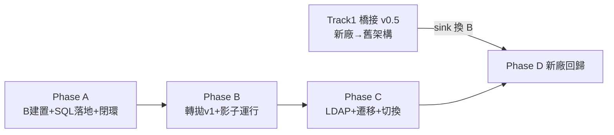

# VOC 平台 — PM 執行路線圖

> 依據：`docs/系統功能與資料架構總覽.md`（As-Is）、`docs/schema_B_設計提案.md`（v2，決策已凍結）。
> 本文件是專案管理視角的總計畫：完成度定義、雙軌道排程、對帳機制、風險登記簿、各階段驗收閘門。
> 建立日期：2026-07-01（決策回覆同日）

---

## 一、現況評估（完成度的誠實定義）

- **功能移植完成度 ≈ 95%**：舊系統全部頁面已有 Python 對應實作，4 個歷史 bug 修復，
  256 個純邏輯測試鎖住業務行為（燈號/派報判斷/簽核狀態機皆不依賴 DB）。
- **可上線度 ≈ 60–65%**，缺口依風險排序：
  1. 🔴 資料層 SQL 從未在真實資料庫上執行過（開發環境無 ODBC）
  2. 🔴 身分與權限未接（LDAP 未做、check_permission 未掛守門、current_user 寫死）
  3. 🟠 未做新舊系統平行驗證（派報判斷對帳）
  4. 🟠 部署與維運（程序拆分、排程、監控告警）
  5. 🟡 6 條業務確認事項（見 CLAUDE.md）

## 二、關鍵決策紀錄（2026-07-01）

| 決策 | 結果 | 對計畫的影響 |
|---|---|---|
| 新廠區時程 | **3 個月內**；可先用一支轉拋程式沿用舊架構 | 拆出 Track 1 緊急軌道；橋接程式設計成未來轉拋 JOB 的前身 |
| DB 引擎 | PG 測試、正式未定 | SQL 層全面遵守引擎可攜規範；正式引擎最遲 Phase C 前定案 |
| 舊系統退場 | 雙軌並行比對後切換 | 需要對帳機制（第四節）；切換有明確驗收閘門 |
| 稽核留痕 | 需要逐時管制值快照 | reading_history 含 SPEC 管制值快照欄（schema v2 已改） |

## 三、雙軌道計畫

### Track 1（緊急・新廠區 3 個月內）：橋接轉拋程式 v0.5

新廠區先接**舊架構**頂住時程，但程式要用新架構的模組化方式寫，避免變成又一筆技術債：

```
[新廠區 Kepware] → (source adapter) → (normalizer 統一內部格式) → (sink adapter)
                                                                      ├─ legacy sink：寫舊 MSSQL VOC_SCADA_WEB 格式（現在用）
                                                                      └─ B sink：寫 Schema B（Phase B 完成後切換）
```

- **三段式設計是重點**：來源、正規化、寫入完全分離。3 個月內交付 legacy sink 版本；
  B 就緒後只換 sink，一行業務邏輯都不用動——這支程式**就是**未來轉拋 JOB 的第一個來源模組。
- **前置需求（需使用者提供）**：新廠區的 Kepware tag 清單與命名規則、監測項目/管制值定義、
  資料更新頻率（對應 `docs/JOB確認清單.md` #1–#3）。
- 驗收閘門：新廠區資料出現在舊系統儀表板且燈號正確、斷訊判斷正確。

### Track 2（主線）：Schema B 與系統現代化

**Phase A — B 建置與資料層落地（現在開始）**
1. 以 SQLAlchemy metadata 定義 Schema B（可攜，PG/MSSQL 皆可 create_all）
2. 平行 agent 進行 SQL 層移植（依 schema v2 + 可攜規範），開發環境起本地 PG 跑**真整合測試**
   ——一次消掉「SQL 沒跑過」這個最大風險
3. 種子資料 script：測試廠區 + 雙測試身分（申請人/簽核人分開、信箱都導向你）+ 可觸發派報的讀值
4. MSSQL→PG 一次性資料匯入工具（真實資料含 N.D/<0.05/6-9 等怪值，測試才有意義）
- **驗收閘門**：你在測試 PG 上完成「申請→簽核→派報→回覆」閉環，信只寄到你自己

**Phase B — 轉拋 JOB v1 與影子運行**
1. Track 1 橋接程式加上 B sink；既有廠區來源（現行 Kepware A 資料庫）接入
2. **影子運行 2–4 週**：新系統排程照真實資料跑派報判斷，TEST_MODE 只寄你；
   每日對帳報表（第四節）比對新舊派報結果
- **驗收閘門**：連續 N 日（建議 14）對帳零重大差異（或差異皆可解釋並被接受）

**Phase C — 上線準備與切換**
1. LDAP 登入 + current_user 貫通 + check_permission 掛守門（`ACL_ENFORCE=True`）
2. 歷史資料遷移：VOC_MAIL_Log（含 msg1 字串→mail_log_item 一次性解析）、closectl、spec、
   mail_list、acl、dept；讀值歷史遷移範圍需決定（建議近 1–2 年，舊庫保留查詢）
3. 正式引擎定案（PG or MSSQL）→ 部署 → 雙軌正式並行 → 切換（舊系統降唯讀保留一季）
- **驗收閘門**：6 條業務確認事項結案、正式環境設定檢查（ACL_ENFORCE/AUTH_MOCK/TEST_MODE）

**Phase D — 新廠區回歸主線**
- 新廠區橋接程式的 sink 從 legacy 切到 B，退役 legacy sink——新架構的第一次投資回收

### 依賴關係


Track 1 與 Phase A **可完全平行**，互不阻塞。

## 四、雙軌對帳機制（Phase B 核心交付物）

- 比對對象：舊 `VOC_MAIL_Log` vs 新 `mail_log`/`mail_log_item`（每日批次）
- 比對維度：該時段「哪些廠×項目×條件」被判定派報、首發/再發標記、escalation 階段
- 容許差異白名單（預先定義，避免對帳變成噪音）：
  已知刻意修正項（mailto 空時 continue、報表含雨水溝、字串比對誤中修正…皆已在程式註解標記）
- 產出：每日 diff 報表（Email 給你），差異需標記「已解釋/需調查」

## 五、風險登記簿

| # | 風險 | 等級 | 緩解 |
|---|---|---|---|
| 1 | SQL 層未經真實 DB 驗證 | 🔴 | Phase A 本地 PG 整合測試，最先做 |
| 2 | 新廠區時程 3 個月與主線搶資源 | 🔴 | Track 1 獨立小交付（僅橋接程式），不動主線範圍 |
| 3 | 正式引擎未定 → 兩邊都要能跑 | 🟠 | 引擎可攜規範強制執行；Alembic 管 schema；CI 若可行雙引擎跑測試 |
| 4 | SignFlow 正式去向未決（組織協調） | 🟠 | 測試期同構表不阻塞；Phase C 前需與相關單位定案，**建議提早開始溝通** |
| 5 | msg1 歷史字串解析（遷移）邊角案例 | 🟠 | 解析器先對全量歷史 dry-run，未解析成功者列表人工檢視 |
| 6 | 單人專案（bus factor） | 🟡 | 文件化已到位（本系列文件+CLAUDE.md）；持續維持「決策都留紀錄」 |
| 7 | 6 條業務確認事項懸置 | 🟡 | 排入 Phase B 期間完成（影子運行時正好有真實案例可對照討論） |

## 六、現在就可以開始的事（建議下一步）

1. **我方（Claude）**：Phase A 啟動——SQLAlchemy Schema B 定義 + 本地 PG + 平行 agent SQL 移植 + 整合測試 + 種子/匯入工具
2. **你**：提供新廠區 Kepware tag 規格（Track 1 前置）；把 SignFlow 去向、6 條業務確認排入與相關單位的溝通
3. 對帳白名單初稿會在 Phase A 尾聲由我先擬，影子運行前你確認

## 六之一、Phase A 沙盒驗收紀錄（2026-07-05）

- ✅ 整合測試 88 綠（真 PG）、純邏輯 281 綠、main_b 首頁等五路由 200、
  閉環演練通過（申請→簽核→超標派報首發、隔離項目正確不派報）；SMTP 逾時屬沙盒環境限制。
- WP2~WP5 主控核可的設計裁決與已知債（後續追蹤）：
  1. `mail_log_item` 目前「每 item 一列」（detail 保留完整 msg1 供 evaluate_row 零修改重用），
     D 決策的逐條件正規化留待 evaluate_row 重構時完成（schema 已支援）
  2. warning_service B 版為同精神簡化實作（雨水溝正式表結構隨 PMS 決策一併定案）
  3. dept 顯示名稱暫用 dept_no（employee 快取補欄位後調整）
  4. 種子資料待補：派報/簽核用 rpttype、虛擬廠區列（測試已自行建立）
  5. 同項目多重 tag_mapping 應加設定告警
- 待補完：main_b 的 control/flow/spec/qa/reason/water_urgent router（資料層皆已就緒）

## 七、已知功能缺口備忘（待補件）

| 功能 | 現況 | 待辦 |
|---|---|---|
| **歷史曲線頁**（2026-07-01 補記） | 原始碼未提供；Python 端只有連結（`VOC_Curve.URL` 指向外部圖表頁，推測依賴舊 Historian） | 使用者提供原始碼後二擇一：忠實移植，或**用 B 的 `reading_history` 自建曲線頁**（建議後者：新歷史表已含逐時讀值+管制值快照，自建同時解除對舊 Historian 的依賴，正好呼應 Historian 退役方向；可排入 Phase B/C） |

---

*本路線圖為活文件：各階段閘門通過或決策變更時更新。*
