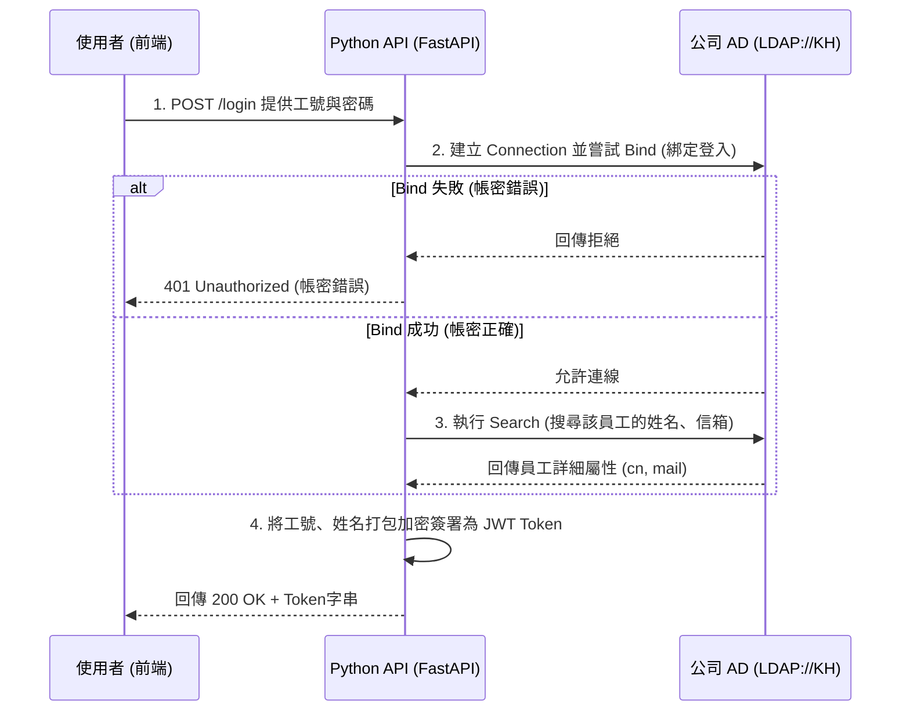

# 企業內部 Active Directory (AD / LDAP) 整合架構與實作指南

這份文件記錄了如何從傳統微軟 Windows 驗證 (`HttpContext.Current.User.Identity`) 轉向現代化 API 導向的 **Python + AD (LDAP)** 標準做法。這套標準不僅適用於本 VOC 重構專案，未來公司內部任何需要身分驗證的 Python 專案都可以無縫套用。

---

## 一、 認證架構演進比對

### 🗄️ 舊有 ASP.NET 做法 (被動認證)
1. **認證模式**：IIS 在 `Web.config` 設定 `<authentication mode="Windows" />`。
2. **流程**：使用者打開網頁，IIS 自動拿取使用者登入 Windows 的網域帳號轉交給網站。
3. **資訊獲取**：程式(`Global.asax`)拿到帳號後，使用 `DirectorySearcher` 連線至 `LDAP://KH` 去搜出詳細的姓名或單位。
*缺點：強烈綁定 IIS 與微軟生態系，若前端改為 Mobile App 或 Vue/React 接 API 則無法順利運作。*

### 🚀 現代化 Python / FastAPI 做法 (主動認證 + Token 機制)
1. **認證模式**：採用 `JWT (JSON Web Token)` + `LDAP`。
2. **流程**：使用者需有一個內部的登入畫面 (Login) 填寫工號與密碼。Python 拿著帳密去敲擊公司的 AD (LDAP) 伺服器驗證，驗證成功就核發一把限時鑰匙 (JWT Token)。
3. **資訊獲取**：Python 使用開源 `ldap3` 工具包查詢資訊，一併將姓名編碼進 Token 裡交還給前端。

---

## 二、 實作核心流程與必要套件

### 1. 準備必要套件 (Python Requirements)
任何專案需要串接，請先確保安裝這兩把交椅：
```bash
pip install ldap3      # 專門用來與 Active Directory 通訊的官方套件
pip install PyJWT      # 負責產生簽名加密的通行證 (Token)
```

### 2. 登入與 LDAP 驗證流程 (標準四部曲)


---

## 三、 Python 實作程式碼公版參考

未來若有新專案，您可以直接複製這份 `auth_service.py` 範本來當作基底使用。

```python
from ldap3 import Server, Connection, ALL
import jwt
from datetime import datetime, timedelta

# 公司環境變數設定 (應放置於 .env 防止外洩)
LDAP_SERVER_URL = "ldap://KH"       # 公司的 AD 伺服器或是網域
AD_DOMAIN = "aseglobal.com"         # 網域名稱
JWT_SECRET_KEY = "your-super-secret-key"

def authenticate_and_get_token(emp_no: str, password: str) -> dict:
    """
    標準 AD 登入驗證器
    """
    # 1. 組裝使用者的 Principal Name (例如: A001@aseglobal.com)
    user_principal = f"{emp_no}@{AD_DOMAIN}"
    
    # 2. 定義 Server 
    server = Server(LDAP_SERVER_URL, get_info=ALL)
    
    # 3. 嘗試把使用者帳密 "Bind" (綁定) 到 AD 上
    # 如果這個連線物件能開啟，代表密碼絕對是正確的
    try:
        conn = Connection(server, user=user_principal, password=password, auto_bind=True)
    except Exception as e:
        # Bind 失敗代表帳號不存在或密碼錯誤
        return {"success": False, "message": "帳號或密碼錯誤"}

    # 4. Bind 成功！接著去 AD 裡把他的註冊資料如姓名、信箱給 "Search" 出來
    search_base = "DC=aseglobal,DC=com" # 視貴公司 AD 架構的根目錄而定
    search_filter = f"(sAMAccountName={emp_no})" # 以工號作為過濾條件
    
    # 要求拉出 cn (通用名稱/姓名) 與 mail (電子信箱)
    conn.search(search_base, search_filter, attributes=['cn', 'mail'])
    
    user_name = emp_no # 預設值
    if conn.entries:
        entry = conn.entries[0]
        user_name = str(entry.cn)
    
    conn.unbind() # 養成好習慣，用完就關閉連線

    # 5. 核發通行證 (JWT Token) 保底 8 小時過期
    payload = {
        "emp_no": emp_no,
        "user_name": user_name,
        "exp": datetime.utcnow() + timedelta(hours=8)
    }
    encoded_token = jwt.encode(payload, JWT_SECRET_KEY, algorithm="HS256")
    
    return {
        "success": True, 
        "token": encoded_token, 
        "user_info": {"emp_no": emp_no, "name": user_name}
    }
```

### 💡 開發強烈建議：
1. **防呆 Mock 開發**：開發期間內網可能不好接，建議在程式加上 `if emp_no == 'admin' and password == '1234': return True` 的後門，方便工程師不用連 AD 也能寫 UI。
2. **連線池(Pool)**：如果未來有大量使用者，`ldap3` 也支援連線池。不過一般內部系統每次登入時才建立連線通常便已足夠。
3. **LDAPS**：正式上線建議改用 `ldaps://KH` (走 SSL/TLS 加密)，避免密碼在內網被明文側錄。
