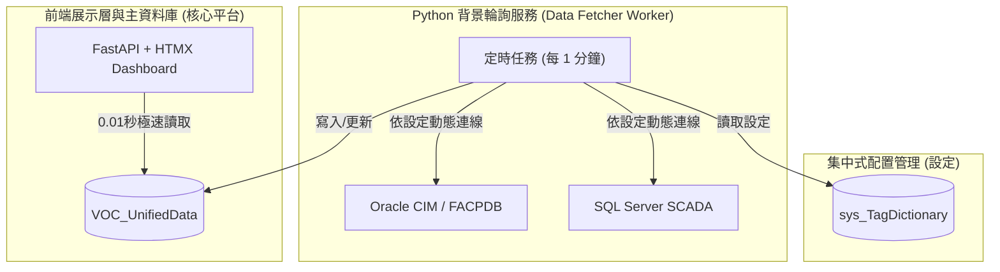

# VOC 平台資料庫標準化與 TAG 匯入重構提案

目前舊系統最大的痛點在於：「**業務邏輯與外部資料庫 (Oracle CIM \ SQL Server) 緊密耦合**」。每次讀取儀表板，網頁伺服器都要自己查兩邊的資料庫，且哪些廠區要抓哪個欄位、什麼 TAG，全部寫死在程式碼的 `If/Else` 與硬核 SQL 中。

為了徹底解決「維護麻煩」與「來龍去脈難以釐清」的問題，我們建議在此次 Python 重構中引入 **「集中式 Metadata 字典」** 與 **「背景統一收集 (ETL) 模式」**。

---

## 🎯 核心重構策略：將設定還給資料庫，程式只負責「執行」

我們建議在 [SignFlow/VOC] 資料庫中，新增三類「設定規格表 (Metadata)」，取代原本寫死在 C# 內的判斷邏輯。

### 1. 建立集中化標籤管理表 `[sys_TagDictionary]` (Metadata)
無論是來自 Oracle (CIM) 還是 SCADA，全部統一登記在此表。程式完全**不認得廠區**，只認這張表上的對應關係！
*這就是您的「管理平台」未來要維護的核心介面。*

| TagID (主鍵) | PlantNo (廠區) | ItemCode (項目) | SourceType (來源) | SourceQueryString (外部查詢字串/TAG) | IsActive (啟用) |
| --- | --- | --- | --- | --- | --- |
| `K1_VOC` | K1 | VOC | `SCADA_SQL` | `SELECT top 1 rvalue from db..scada where tag='VOC1'` | 1 |
| `K2_PH` | K2 | pH | `CIM_ORACLE`| `FACPDB.PH_TAG_001` | 1 |

> **好處**：未來廠區如果換了儀器、改了 TAG Name，或者新增了 K4 廠，您完全不需要改 Python 或 C# 程式碼，只要進這張表（我們能為此做一個 CRUD 管理畫布）修改對應的字串即可！

---

### 2. 建立資料彙整點 `[VOC_UnifiedData_Timeseries]` (統一暫存表)
將舊系統中四散的 `VOC_SCADA_WEB` 與各種讀值，收斂成唯一的一張事實表。網頁儀表板以後**只讀這張表**，不再直接跨 DB 去即時撈 CIM 或外部數據。

| TagID | RValue (最新讀值) | OOS_Alert (是否超出防呆) | UpdateTime (更新時間) | Status (狀態: 正常/斷訊) |
| --- | --- | --- | --- | --- |
| `K1_VOC` | 75 | 0 | 2024-11-15 13:00 | 正常 |

> **好處**：前端儀表板 (Dashboard) 載入速度將**爆炸性提升**，從需要等 3~5 秒的複雜 Join，變成 0.1 秒即可完成，因為資料已經事先整理好了。

---

### 3. 架構層面：新增背景採集任務 (APScheduler / Celery)

舊系統是使用者**「打開網頁的瞬間」**去讀取各 DB；
新系統將改為**「背景排程自動讀取」**。

---

## 📈 總結與效益

如果採用這套全新的**資料導向設計 (Data-driven Architecture)**，您所擁有的管理平台將不再只是一個拼湊兩個 DB 的「展示看板」，而會升級為一個**「能夠設定所有擷取策略的中控大腦」**。

1. **維護成本極低**：未來任何儀器維護、更換 TAG、資料庫位址變更，全都在網頁中控台上改設定即可。
2. **斷訊防呆更精準**：背景任務如果在抓取 Oracle 時發生 Timeout，可以立刻把 `VOC_UnifiedData` 的狀態標記為「斷訊」，並直接觸發 Line/Email 警報，不用等主管開網頁才發現異常。
3. **系統穩定度 100% 提升**：即使 CIM 或外部資料庫臨時掛掉，使用者的網頁儀表板依然能瞬間開啟，只會看到「舊資料」與「斷訊警示」，而不會遇到 500 Internal Server Error (崩潰)。

如果您認同這個「打通來龍去脈」的架構重構方向，我們可以優先把這個 **「中央 TAG 管理庫 (`sys_TagDictionary`)」** 的 Schema 設計出來，取代原先直接在 `dbVOC.cs` 中 Join 來 Join 去的做法。
