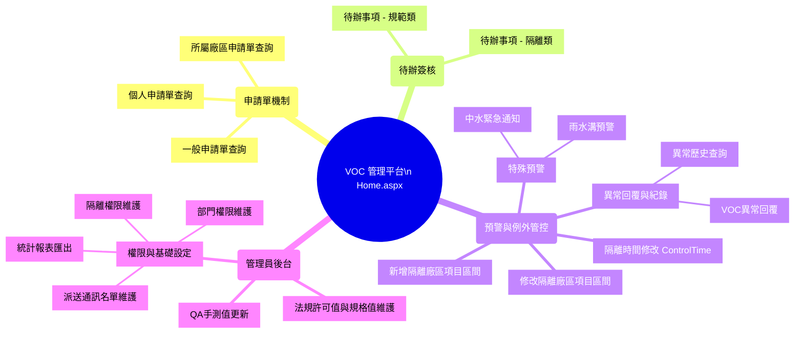

# VOC 廠務法規許可標準化管理平台 - 分頁功能解析與 SiteMap

根據專案目錄中的 ASP.NET 頁面源碼與標題解析，本平台主要分為「五大核心模組」。以下為針對尚未交接之網站整理的功能映射與網站架構圖。

## 🕸 網站分頁功能分類對照表

### 1. 🏠 主頁與儀表板 (Dashboard & Home)
| 頁面檔案 | 頁面標題 / 功能用途 |
| --- | --- |
| `Home.aspx` | **廠務法規許可值標準化管控平台**：系統登入後的主要儀表板。 |
| `Default.aspx` | 預設轉址頁面，通常導向 `Home.aspx`。 |

### 2. 📝 申請單查詢模組 (Application System)
提供各種層級的申請單查詢入口：
| 頁面檔案 | 頁面標題 / 功能用途 |
| --- | --- |
| `MyApply.aspx` | **個人申請單查詢**：使用者查詢自身提交的各項規格、管制申請。 |
| `PlantApply.aspx` | **所屬廠區申請單查詢**：依據使用者所屬廠區，查詢該廠區內的所有申請單。 |
| `ApplySPEC.aspx` | **申請單查詢**：一般全域性查詢 (可能有特定角色權限)。 |

### 3. ✍️ 簽核與待辦模組 (Sign-off Workflows)
供主管或特定權限人員進行審核發行的簽核收件匣：
| 頁面檔案 | 頁面標題 / 功能用途 |
| --- | --- |
| `SignSPEC.aspx` | **個人待辦事項 (規範類)**：針對法規或是規格修改之簽核。 |
| `SignControl.aspx` | **個人待辦事項 (隔離類)**：針對系統隔離或例外處理申請之簽核。 |

### 4. 🚨 廠區隔離、預警與異常控管 (Exception & Early Warning)
工廠設備的隔離報備、例外設定與異常情況回報：
| 頁面檔案 | 頁面標題 / 功能用途 |
| --- | --- |
| `EditControl.aspx` | **新增隔離廠區項目區間**：提出需要對特定廠區項目進行測值或系統處理隔離的申請。 |
| `ModifyControl.aspx` | **修改隔離廠區項目區間**：調整已核准或現有隔離區間的參數。 |
| `ControlTime.aspx` | **所屬廠區申請單隔離時間修改**：專注於該廠區下之隔離時間異動調整。 |
| `WaterUrgent.aspx` | **中水緊急通知**：中水處理相關突發事件警告或操作介面。 |
| `RainGutter.aspx` | **雨水溝預警**：雨水溝處理機制之監測或預警設定頁面。 |
| `VOCreason.aspx` | **異常原因回覆**：針對發生數值異常的狀況，由負責人進行異常處理報告填寫。 |
| `VOChistory.aspx` | **異常件數查詢**：供管理者調閱歷史發生的異常警報紀錄。 |

### 5. ⚙️ 後台系統管理與基礎維護 (System Admin & Spec Maintenance)
僅開放給具備管理權限 (Admin) 或是特定單位操作的配置中心：
| 頁面檔案 | 頁面標題 / 功能用途 |
| --- | --- |
| `EditSPEC.aspx` | **法規許可值與規格值維護**：維護整個廠務法規數值（規格上下限等）的核心頁面。 |
| `EditQA.aspx` | **QA手測值更新**：人工登錄/更新實驗室 QA 測試數據以輔助系統驗證。 |
| `EditAclUser.aspx` | **隔離權限維護**：管理哪些員工具有執行或核准隔離設定的存取控制名單 (ACL)。 |
| `EditDeptList.aspx` | **部門權限維護**：設定系統對應的組織圖、部門對照及角色。 |
| `EditMailList.aspx` | **派送名單維護**：維護系統發信 (如審核通知、防呆或異常預警) 的收件人通訊清單。 |
| `VOCreport.aspx` | **報表匯出產出** (推測)：可能提供法規許可數值的月/季/年度報表檢視與列印。 |

---

## 🗺 網站 SiteMap (架構樹狀圖)

以下是以操作樹狀圖呈現的功能進入點，這代表系統主選單 (Menu) 理想上的架構：

## 給接手人員的建議
1. **先看主邏輯**：由於所有後台與權限功能都是為了支撐「法規許可值 (`EditSPEC.aspx`)」不被誤改，而且變更許可值或新增隔離都需要跑「簽核系統 (`SignSPEC.aspx`、`SignControl.aspx`)」。
2. **留意身分驗證**：專案使用 `Global.asax` 取 LDAP 作權限控管 (`DbSession` 的 `AppConfig.Sess_IsAdmin` 判斷)，若測試環境需要本機瀏覽，可能會需要關閉或 Mock 單點登入以繞過 LDAP 檢查。
