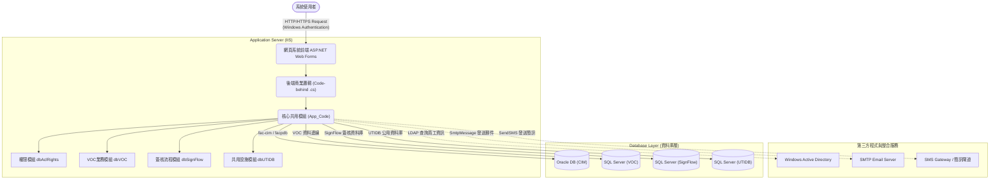
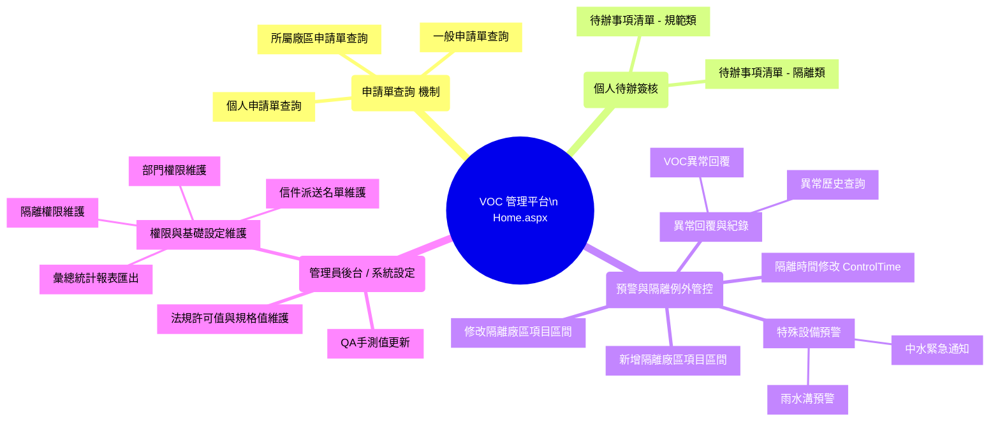

# 廠務法規許可標準化管理平台 (VOC) - 系統分析報告

本報告結合了基於專案目錄、配置 (`Web.config`、`Global.asax`、`App_Code`) 以及各頁面源碼 (`.aspx`) 所提取之資訊，為後續接手維護人員提供系統運行與網頁模組之完整對照指南。

---

## 一、 系統架構圖 (System Architecture)

### 架構技術特徵
1. **前端與呈現層**：採用 **ASP.NET Web Forms** 開發 (`.aspx`)，搭配 `theme1` 佈景主題。
2. **驗證機制**：使用 **Windows 驗證** (Intranet 環境常見)，且會在 `Session_Start` 時串接 **LDAP (Active Directory)** 進行員工姓名與單位資料之查詢與綁定。
3. **核心模組 (`App_Code`)**：
   - `dbAclRights.cs`: 處理權限管控 (如 `GetIsAdmin`)。
   - `dbVOC.cs`, `dbUTIDB.cs`: 處理業務核心資料進出。
   - `dbSignFlow`: 建立與簽核處理機制有關的邏輯。
   - `SendSMS.cs`, `SmtpMessage.cs`: 封裝簡訊與電子信件發送功能。
4. **資料庫連線** (對應於 `Web.config`)：
   - 核心系統主要使用 **SQL Server** 分庫 (`VOC`, `SignFlow`, `UTIDB`)。
   - 另透過內部連線 (`OraCIMConnStr` - `10.10.22.192`) 接至廠區 **Oracle 資料庫** (`facpdb`) 做為 CIM 存取。

---

## 二、 🕸 網站分頁功能分類對照表

整個平台約有 20 多個主要功能頁，依據開發分類可以拆分為「五大核心處理模組」：

### 1. 🏠 主頁與儀表板 (Dashboard & Home)
| 頁面檔案 | 頁面標題 / 功能用途 |
| --- | --- |
| `Home.aspx` | **廠務法規許可值標準化管控平台**：系統登入後的主要儀表板。 |
| `Default.aspx` | 預設轉址頁面，通常導向 `Home.aspx`。 |

### 2. 📝 申請單查詢模組 (Application System)
提供各種層級的申請單查詢入口：
| 頁面檔案 | 頁面標題 / 功能用途 |
| --- | --- |
| `MyApply.aspx` | **個人申請單查詢**：使用者查詢自身提交的各項規格、管制申請。 |
| `PlantApply.aspx` | **所屬廠區申請單查詢**：依據使用者所屬廠區，查詢該廠區內的所有申請單。 |
| `ApplySPEC.aspx` | **申請單查詢**：一般全域性查詢。 |

### 3. ✍️ 簽核與待辦模組 (Sign-off Workflows)
主管或特定權限人員進行審核的收件匣：
| 頁面檔案 | 頁面標題 / 功能用途 |
| --- | --- |
| `SignSPEC.aspx` | **個人待辦事項 (規範類)**：針對法規或是規格修改之簽核。 |
| `SignControl.aspx` | **個人待辦事項 (隔離類)**：針對系統隔離或例外處理申請之簽核。 |

### 4. 🚨 廠區隔離、預警與異常控管 (Exception & Early Warning)
工廠設備的隔離報備、例外設定與異常情況回報：
| 頁面檔案 | 頁面標題 / 功能用途 |
| --- | --- |
| `EditControl.aspx` | **新增隔離廠區項目區間**：提出需要對特定項目進行隔離的申請。 |
| `ModifyControl.aspx` | **修改隔離廠區項目區間**：調整已核准隔離區間的參數。 |
| `ControlTime.aspx` | **所屬廠區申請單隔離時間修改**：專注於隔離時間的異動申請與調整。 |
| `WaterUrgent.aspx` | **中水緊急通知**：中水處理相關突發事件警告管理。 |
| `RainGutter.aspx` | **雨水溝預警**：雨水溝處理機制之監測與預警管理。 |
| `VOCreason.aspx` | **異常原因回覆**：針對發生數值異常的狀況，由負責人進行異常原因的報備與填寫。 |
| `VOChistory.aspx` | **異常件數查詢**：供管理者調閱歷史異常紀錄。 |

### 5. ⚙️ 後台系統管理與基礎維護 (System Admin & Spec Maintenance)
僅開放給特定單位或管理權限 (`IsAdmin`) 操作的系統設定中心：
| 頁面檔案 | 頁面標題 / 功能用途 |
| --- | --- |
| `EditSPEC.aspx` | **法規許可值與規格值維護**：維護整個廠區對應的測量數值與規範上下限 *(網站核心功能)*。 |
| `EditQA.aspx` | **QA手測值更新**：人工記錄實驗室 QA 手動觀測數據以輔助系統驗證。 |
| `EditAclUser.aspx` | **隔離權限維護**：管理「誰」有權限能執行隔離設定的操作存取名單 (ACL)。 |
| `EditDeptList.aspx` | **部門權限維護**：維護員工與各組織單位的對照及預設角色。 |
| `EditMailList.aspx` | **派送名單維護**：設定系統發送 E-mail (審核、防呆、異常) 時的系統通訊清單。 |
| `VOCreport.aspx` | **報表匯出產出**：推測提供法規許可數據的月/季/年度視圖。 |

---

## 三、 🗺 網站 SiteMap (架構樹狀圖)

以下是以操作路徑模擬所繪製出的架構圖 (等同於系統的主選單結構層級)：

## 四、 給接手人員的維護建議
1. **先釐清主邏輯**：本系統的終極目的為保護「法規許可與規格值 (`EditSPEC.aspx`)」，且舉凡要變動許可值或是提出新隔離，最終都會連動至「簽核系統 (`SignSPEC.aspx`、`SignControl.aspx`)」，建議查修 Bug 時可由此核心溯源。
2. **留意身份與認證邊界**：本機除錯時 `Global.asax` 裡的 `MTDBbase.Get員工姓名(..., "LDAP://KH")` 很可能因為離開內部環境或 AD 網域而產生連線 Error。測試時若無法連進內網，可能需 Mock掉 LDAP 的行為。
3. **App_Code 職責釐清**：`dbVOC.cs` 容量龐大包辦了所有廠區判斷邏輯，後續重構或盤點如果想抽離模組，請務必搭配 `dbSignFlow.cs` 一同測試，避免簽核狀態不同步。
