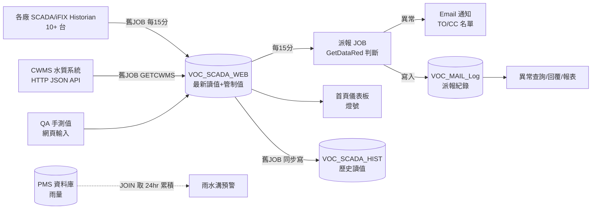

# VOC 平台 — 系統功能與資料架構總覽（As-Is）

> 目的：作為 Schema B 設計討論的**共同基準**。本文件只描述「系統現在（含舊系統原設計）是怎麼運作的」，
> 不含改善建議——改善建議與新 schema 提案見 `docs/schema_B_設計提案.md`。
> 內容依據：`legacy/` 全部原始碼精讀（見 `docs/legacy_source_analysis.md`）+ 已完成移植的 Python 程式。
> 建立日期：2026-07-01

---

## 一、系統在做什麼（一句話版）

監控高雄廠區各廠（K1～K27）的**廢水／空污排放數值**（pH、COD、Cu、Ni、SS、VOC、導電度、雨水溝…），
依三層門檻（OOS＞OOC＞Alert）自動計算紅/橙/黃/綠燈，超標時 **Email 派報**給該廠負責人，
負責人回覆異常原因留檔；相關的規格值變更與廠區隔離（暫停監測）都要走**簽核流程**。

## 二、整體資料流

**第二階段目標**：SCADA 來源改為既有 Kepware 架構（A），由本專案撰寫轉拋 JOB 寫入新 VOC 資料庫（B，
即 Schema B），Web 與派報改讀 B。

## 三、九大功能區塊（原樣說明）

### 1. 首頁儀表板（Home）
- 全廠×全項目一張大表：法規許可值(LAW)、SPEC 三階文件值(OOS/OOC/Alert/允收值)、
  SCADA 自設管制值(OOS-HH/OOC-H/Alert)、CWMS 管制值、最新讀值、燈號。
- 燈號**即時重算**（不讀 DB 的 light 欄）：
  `讀值≥OOS→紅`；`OOC≤讀值<OOS→橙`；`SCADA/CWMS 管制值≠SPEC→橙（設定不同步提醒）`；
  `Alert<讀值<OOC→黃`；`讀值>允收值→黃`；`斷訊/非數字→灰`；其餘綠。
- 特殊規則：pH/溫度雙邊規格（存 `'6-9'` 字串）**只比上界**；VOC 項目 SCADA 比 SPEC 嚴不算不一致；
  數值比對前 round(2) 對齊舊系統；讀值欄底色依來源（SCADA 米白/CWMS 橙/QA 灰）；
  `VOC_EmptyCell` 控制哪些格子顯示斜紋（該廠該項目沒有此欄位）。

### 2. 異常 Email 派報（原為外部 JOB，每 15 分鐘）
- 流程：隔離中項目先標保養中 → 撈全廠資料 → 逐筆 `GetDataRed` 判斷 → 依廠合併成一封 HTML 信 →
  查 `VOC_Mail_List` 名單（TO 嚴格綁廠；CC 額外含 GMO/環工部）→ 寄信 → 寫 `VOC_MAIL_Log`。
- **首發/再發**：查該廠該項目最後一筆派報紀錄，超過 4 小時或「異常內容變了」→ 首發；
  4 小時內同內容，OOC/OOS 類異常仍在第 0/15/30 分鐘各補發一次（共 3 次）後靜默。
  判斷方式 = 比對上一筆 `msg1` 字串內容。
- K14B 跨廠通報：任一廠讀值「＞允收值」時 CC K14B 名單。
- 特化通知：雨水溝預警（K1/K9 有三點連升判斷）、中水陸放/放流量管控（K14B）、IH 斷訊通知。

### 3. 異常查詢／原因回覆／報表（共用 VOC_MAIL_Log）
- 查詢（VOChistory）：日期+廠+項目+MT 勾選篩選；件數統計靠 `msg1 LIKE '%|item|%'` 字串比對。
- 回覆（VOCreason）：對某筆派報填原因，寫回 `empno/reason/rdatetime`，時間對齊 5 分鐘邊界，
  依訊息內容分流寄 4 種回覆通知信。無獨立狀態欄，「已回覆」= reason 有值。
- 報表（VOCreport）：各廠件數統計+廠×項目 PIVOT 交叉表+排行（線上畫面，非匯出檔）。

### 4. 廠區隔離申請與簽核
- 申請隔離（EditControl）：選廠+項目+時間區間（**上限 1 小時**），送簽後建簽核流程。
- 核准後：派報 JOB 把該項目讀值/管制值標成「保養中」、broken=2，期間不派報。
- 修改單（ModifyControl）：對有效隔離建 ttypeid=2 新單、orgccid 指向原單、重走簽核。
- 時間修改（ControlTime）：roleid=12 專用**不走簽核**的直改通道，僅能延長。
- 簽核（SignControl）：簽核人 = `VOC_Mail_List` 中該廠 rpttype（水保養中/空保養中）SignGrp=1 的人，
  **任一人**核准(7)/否決(8)即結案（單關卡 OR 邏輯，無多級主管）。
- 單號 ccno：`yyyyMMddNNN` 11 碼字串，當日流水。

### 5. 規格值維護與規格簽核
- EditSPEC：維護 `VOC_SPEC`（LAW/OOS/OOC/Alert/允收值/來源），欄位驗證（OOC>Alert 等）；
  QA 來源項目改規格時同步更新 `VOC_SCADA_WEB` 管制值欄。
- 規格簽核（ApplySPEC/SignSPEC）：變更申請寫 `VOC_SPEC_apply`（ftype I新增/M修改/D刪除，
  formno 同 ccno 格式），核准後套用回 `VOC_SPEC`。⚠️ 此路徑在舊系統是**從未上線的死碼**，
  Python 版為按正確行為重新設計。
- 項目別名：K14B/K22/九號放流口的 pH 實際存 `pH1`、K14B 的 COD 存 `COD2`，顯示時轉回 pH/COD（程式硬編）。

### 6. 派送名單維護（EditMailList）
- `VOC_Mail_List` 主鍵 `(plantno, rpttype, empno)`；一人可在多廠多報表類型出現。
- 欄位一表三用：**收件人**（mailtype TO/CC + mail 開關）＋**簡訊名單**（SM，已停用）＋
  **簽核人**（signgrp=1）。rpttype 除派報類型（水質異常/水Alert…）外還有簽核專用的「水保養中/空保養中」。
- notesid 存 Lotus Notes ID（底線轉空白、去網域），寄信時還原成 email。
- 全域暫停寄信：把每列 `Mail/SM` 備份到 `Mail1/SM1` 後歸零；恢復時倒回來。

### 7. QA 手測值（EditQA）
- source=3 的項目由人工輸入讀值，直接 UPDATE `VOC_SCADA_WEB.rvalue`，寫 tranlog。

### 8. 權限系統（ACL）＋部門權限
- 三張表：`sys_aclrole`（12 種角色）× `sys_acluserrole`（人↔角色↔廠區，plantno 可 'ALL'）×
  `sys_aclrolerights`（角色↔功能↔allowrights 位元：查詢1/修改2/新增4/刪除8/執行16）。
- `VOC_dept`（plantid, deptno, cdatetime）：部門→可視廠區，plantid=29 代表全廠；
  登入者部門決定首頁能看到哪些廠（GetPlantID）。
- 登入：舊系統走公司 LDAP；Python 版目前 mock（AUTH_MOCK），Phase 3 才接。

### 9. 簽核框架（SignFlow，全公司共用的外部資料庫）
- `base_flow`（主檔：fruleid 流程種類、fstatusid 狀態、fid 關聯單號）＋
  `base_flowd`（每關卡每簽核人一列）＋ `base_emp`（員工快取，empno→empid/email）。
- 狀態值：待簽核=0、簽核中=1、核准=7、否決=8、取消=12。
- VOC 用到 fruleid=8（隔離）與 9（規格），皆為單關卡群組簽核。
- ⚠️ 這顆資料庫同時服務公司其他系統（CCTV/PLC/異常管理…），不是 VOC 專屬。

## 四、資料表清單（As-Is，含怪癖備註）

### 核心監測
| 表 | 用途 | 關鍵欄位 / 怪癖 |
|---|---|---|
| `VOC_plant` | 廠區主檔 | plantid(29=ALL 魔法值)、plantno、isShow、sort；'GMO'/'環工部' 是虛擬廠區列 |
| `VOC_item` | 項目主檔 | itemid、item、unit、IsActive；pH1/pH2/COD1/COD2 別名靠程式處理 |
| `VOC_source` | 讀值來源 | 1=SCADA、2=CWMS、3=QA |
| `VOC_SPEC` | 規格三階文件 | PK(plantno,item)；LAW/OOS/OOC/alert/recv 全是 **varchar**（雙邊存 '6-9'、可存 '-'/'N/A'）；tagname；seqno 排序 |
| `VOC_SCADA_WEB` | **最新**讀值+各來源管制值 | PK(plantno,item)；rvalue varchar 混存（數字/'N.D'/'<0.05'/'斷訊'/'保養中'/'建置中'）；SCADA 管制值 OOS_HH/OOC_H/alert(+下限 _LL/_L)；CWMS 管制值 OOS_HH1/OOC_H1(+下限)；broken(0/1/2)；light（JOB 寫，新系統不讀）；TwentyFourHours（雨量，來自 PMS JOIN） |
| `VOC_SCADA_HIST` | 歷史讀值 | 同 WEB 結構每 15 分一筆；⚠️ **隔離時會被 UPDATE 竄改**成「保養中」，燈號也回寫，歷史非 append-only |
| `VOC_Curve` | 歷史曲線連結 | plantno,item→URL（外部圖表頁） |
| `VOC_EmptyCell` | 畫面空格控制 | emptycell 存 "8;9;" 字串＝哪幾欄畫斜紋 |

### 派報與異常
| 表 | 用途 | 怪癖 |
|---|---|---|
| `VOC_MAIL_Log` | 派報紀錄+原因回覆 | logid PK；**msg**（人讀信件文字）/**msg1**（`\|item\|：條件` 格式，供 LIKE 比對＝首發再發與統計的依據，0/15/30 escalation 狀態也藏在字串裡）/**msg2**（msg1 排除保養中的子集合）；empno/reason/rdatetime（回覆回填）；cdatetime 對齊 5 分鐘 |
| `VOC_report` | 報表全域暫存表 | ⚠️ 併發互蓋，Python 版已棄用 |
| `VOC_SMS_Log` | 簡訊紀錄 | SMS 已停用，不再需要 |

### 隔離與簽核
| 表 | 用途 | 怪癖 |
|---|---|---|
| `VOC_closectl` | 隔離申請主檔 | ccid identity PK；ccno char(11) yyyyMMddNNN（程式查 MAX+1）；ttypeid 1新增/2修改；orgccid 修改單指向原單；fstatusid；del/delclerk 軟刪 |
| `VOC_closectl_list` | 隔離明細 | ccid+plantno+item（存 pH1/COD2 原名）+sourceid |
| `VOC_closectl_his` | 隔離歷程 | 主檔全欄複製+utypeid(1新增/2送簽/3修改)+utime+uclerk('empno-name' 串) |
| `VOC_SPEC_apply` | 規格變更申請 | formid PK；formno 同 ccno 格式；ftype I/M/D；規格欄全複製一份 |
| SignFlow.`base_flow/base_flowd/base_emp` | 簽核框架 | **外部共用庫**；empid 是 SignFlow 自己的代理鍵，要先 Get員工id |

### 名單與權限
| 表 | 用途 | 怪癖 |
|---|---|---|
| `VOC_Mail_List` | 收件人+簽核人名單 | PK(plantno,rpttype,empno)；一表三用（信/簡訊/簽核）；Mail1/SM1 全域暫停備份欄 |
| `VOC_Mail_Type` | 報表類型字典 | typeid→RptType |
| `VOC_dept` | 部門↔廠區 | 只有 (plantid, deptno, cdatetime)；plantid=29=ALL |
| `sys_aclrole / sys_acluserrole / sys_aclrolerights` | 角色權限 | allowrights 位元旗標；plantno 可 'ALL'；stype 空/水/ALL |
| `VOC_tranlog` | 操作軌跡 | databefore/dataafter 用**斜線串**（'K7/水質異常/E001/…'） |

### 舊 JOB 專用（第二階段轉拋 JOB 相關）
| 表 | 用途 |
|---|---|
| `VOC_SCADA_TagList` / `VOC_SCADA_Tag` | Historian tag ↔ (plantno,item,欄位) 對應；K14B 流量即時值 |
| `VOC_Flow_Sta` | 陸放/納管/閘門狀態（中水通知用） |
| `VOC_AVG` / `VOC_SCADA_WATER_HIST` / `VOC_A5`（VOC1/VOC2 庫） | 日平均、水務歷史、A5 月保留（衍生統計） |
| `VOC_DataLog` | JOB 執行紀錄 |

### 跨庫依賴（VOC 資料庫之外）
| 庫.表 | 用途 | 第二階段的問題 |
|---|---|---|
| `SignFlow.dbo.*` | 簽核框架 | 全公司共用，遷 PG 後何去何從＝決策點 |
| `UTIDB.dbo.Employee` | 員工主檔（empno/empname/notesid/isLeave） | 名單帶值、離職過濾都要用 |
| `PMS.dbo.Water_WindRainHistValue` | 24hr 累積雨量 | 雨水溝紅燈條件依賴 |

---

*本文件為 As-Is 快照；Schema B 提案與改善建議見 `docs/schema_B_設計提案.md`。*
