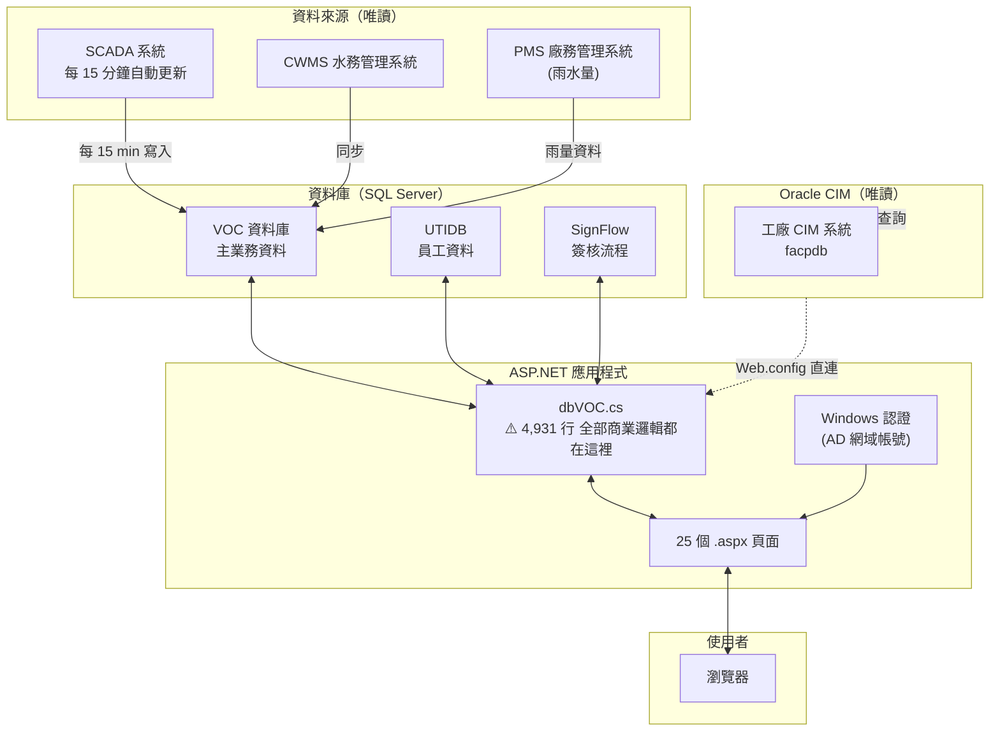
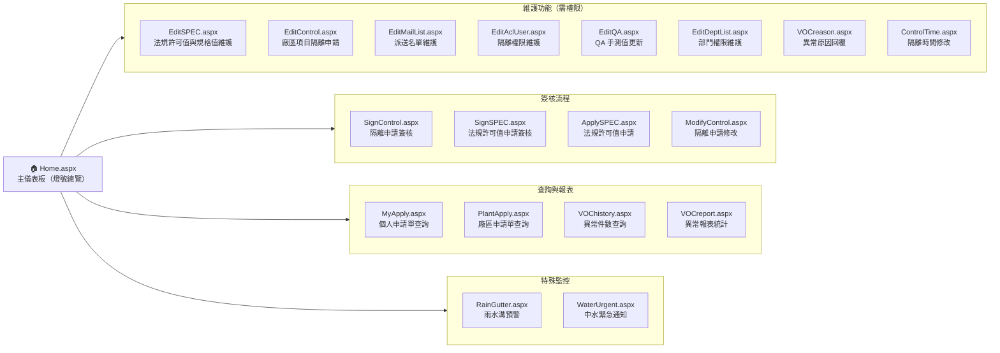
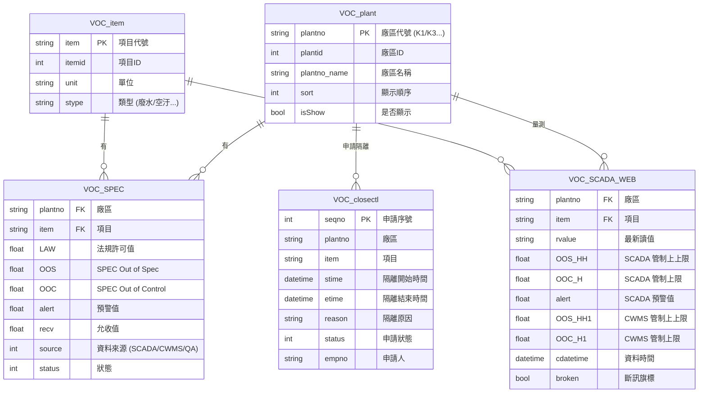
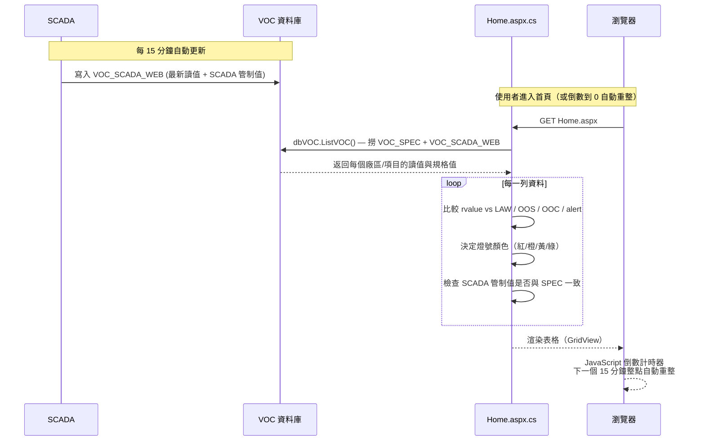
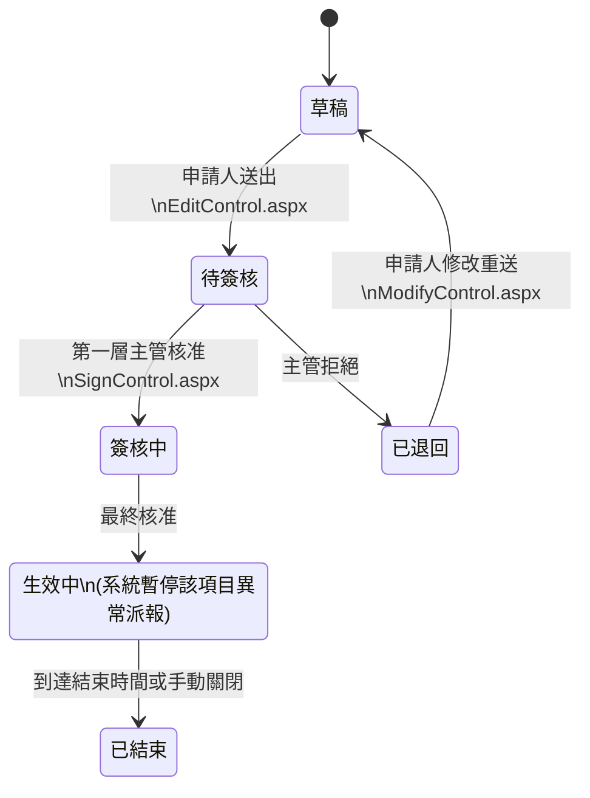
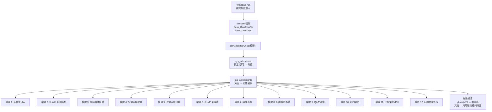

# 廠務法規許可標準化管理平台 — 系統架構說明

> 本文件目的：讓接手人員在 15 分鐘內看懂這個系統在做什麼、怎麼運作、哪裡容易出問題。

---

## 一、這個系統在做什麼

廠區的廢水、空汙等環保數據必須符合法規標準（許可值）。這個系統做三件事：

| 功能 | 說明 |
|------|------|
| **即時監控** | 從 SCADA / CWMS 抓最新量測值，跟法規許可值比較，用紅/橙/黃/綠燈顯示狀態 |
| **隔離申請簽核** | 設備維修或異常時，提出隔離申請→主管簽核，期間暫停該項目的異常派報 |
| **異常通報** | 超標時自動發 Email 和簡訊給負責人 |

### 燈號判斷邏輯

```
最新讀值 vs 三層門檻值：

  最新讀值 ≥ OOS (Out of Spec)          → 紅燈 🔴  最嚴重
  OOC ≤ 最新讀值 < OOS                  → 橙燈 🟠
  Alert < 最新讀值 < OOC                 → 黃燈 🟡
  最新讀值 ≤ Alert                       → 綠燈 🟢  正常
  SCADA/CWMS 管制值 ≠ SPEC 設定值        → 橙燈 🟠  (管制值不一致)
```

---

## 二、整體系統架構



---

## 三、頁面地圖與功能對應



---

## 四、資料庫核心資料表



---

## 五、燈號判斷完整資料流



---

## 六、隔離申請簽核流程



---

## 七、權限系統說明



### 權限矩陣（主要按鈕可見性）

| 按鈕 | 需要的權限 | 說明 |
|------|-----------|------|
| 法規許可值與規格值維護 | 權限 2 | 修改 LAW/OOS/OOC/Alert 等門檻 |
| 廠區項目隔離抑制維護 | 權限 3 | 新增隔離申請 |
| 異常派報簡訊啟用/停用 | 權限 4 / 5 | 全局開關 |
| 派送名單維護 | 權限 6 | 修改收件人 |
| 隔離權限維護 | 權限 8 | 管理誰能申請哪個廠區 |
| QA手測值更新 | 權限 9 | 手動輸入量測值 |
| 部門權限維護 | 權限 10 | 管理部門可看哪些廠區 |
| 中水緊急通知 | 權限 11 | 發緊急通知 |
| 隔離時間修改 | 權限 12 | 事後修改隔離期間 |

---

## 八、程式碼結構（為什麼難維護）

```
VOC/
├── App_Code/
│   ├── dbVOC.cs          ⚠️ 4,931 行！所有商業邏輯、SQL、Email、SMS 都在這
│   ├── dbAclRights.cs    ✅ 還算獨立（權限查詢）
│   ├── AppConfig.cs      ✅ Session 包裝
│   ├── dbUTIDB.cs        ✅ 員工資料查詢
│   ├── SendSMS.cs        簡訊發送
│   └── BasePage.cs       頁面基礎類別
│
├── [PageName].aspx       25 個 UI 頁面（HTML 混 ASP.NET 控制項）
├── [PageName].aspx.cs    25 個後置代碼（總計 5,851 行）
│
└── Web.config            DB 連線字串、認證設定
```

### 主要痛點

| 問題 | 影響 |
|------|------|
| `dbVOC.cs` 一個檔案包山包海 | 找函式要 Ctrl+F，改一個地方怕影響其他地方 |
| 函式命名混用中文（`List廠區`, `List廠區0`, `List廠區1`...） | 根本不知道哪個給哪個頁面用 |
| SQL 字串拼接直接寫在 C# 裡 | 無法重用、難以測試 |
| 沒有測試 | 改完不知道有沒有壞掉 |
| Windows 認證綁定 AD | 只能在公司內網跑，部署困難 |
| Oracle 連線字串寫死在 `Web.config` | 包含帳號密碼明文（安全風險）|

---

## 九、各廠區代號對照（已知）

| plantno | 說明 |
|---------|------|
| K1, K9 | 有雨水溝特殊監控邏輯的廠區 |
| ALL | 系統管理用（plantid=29 可看全廠） |
| 環工部, GMO | 排除在廠區清單外的特殊節點 |

> ⚠️ 完整廠區清單需查詢資料庫 `VOC_plant` 資料表。

---

## 十、已啟動的 Python 重構專案

學姊已經啟動了現代化重構，放在 `VOC_Python_Rebuild/`：

```
舊系統 (ASP.NET)          新系統 (FastAPI Python)
─────────────────         ─────────────────────────
dbVOC.cs (4931 行)    →  services/ (8 個獨立 Service)
.aspx.cs (5851 行)    →  routers/ (7 個 REST API)
直接 SQL 字串         →  SQLAlchemy ORM models/
Windows 認證          →  LDAP → JWT Token
沒有測試              →  Pytest 10 個測試模組
```

**重構進度**：Phase 1-5 架構已完成，處於雙軌並行測試階段（TEST_MODE 避免二次派報）。

---

## 十一、快速 Troubleshooting

| 現象 | 先檢查的地方 |
|------|------------|
| 儀表板燈號沒更新 | SCADA 是否在寫 `VOC_SCADA_WEB`？查 `cdatetime` 欄位 |
| 某廠區看不到 | 使用者部門 → `VOC_dept` → `plantid` 對應是否正確 |
| 按鈕不見了 | `sys_acluserrole` / `sys_aclrolerights` 是否有對應權限 |
| Email 沒收到 | `VOC_Mail_List` 收件人名單、以及派報是否被停用 |
| 隔離申請送出後沒動靜 | `VOC_closectl.status` 查申請狀態，`SignControl.aspx` 是否有待簽核項目 |

---

*文件產出日期：2026-05-16 | 由 Claude Code 依程式碼逆向分析產生*
